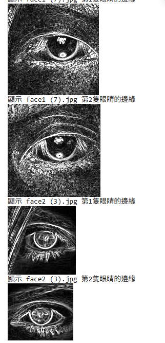

# side project

## Tools流程
+ **OpenCV 內建**
+ **Sobel**

## 程式碼
```python=
import cv2
import numpy as np
from google.colab import files
from google.colab.patches import cv2_imshow  # Colab 專用顯示

# 上傳圖片
uploaded = files.upload()  # 會跳出選擇檔案視窗

# 載入 OpenCV 內建的眼睛偵測分類器
eye_cascade = cv2.CascadeClassifier(cv2.data.haarcascades + 'haarcascade_eye.xml')

# 逐一處理上傳的圖片
for filename in uploaded.keys():
    # 將上傳檔案轉為 OpenCV 可讀格式
    img = cv2.imdecode(np.frombuffer(uploaded[filename], np.uint8), cv2.IMREAD_COLOR)
    if img is None:
        print(f"無法讀取圖片: {filename}")
        continue

    gray = cv2.cvtColor(img, cv2.COLOR_BGR2GRAY)

    # 偵測眼睛
    eyes = eye_cascade.detectMultiScale(gray, scaleFactor=1.1, minNeighbors=5)
    if len(eyes) == 0:
        print(f"未偵測到眼睛: {filename}")
        continue

    for i, (x, y, w, h) in enumerate(eyes):
        eye_roi = gray[y:y+h, x:x+w]

        # Sobel 邊緣檢測
        sobelx = cv2.Sobel(eye_roi, cv2.CV_64F, 1, 0, ksize=3)
        sobely = cv2.Sobel(eye_roi, cv2.CV_64F, 0, 1, ksize=3)
        sobel_edge = cv2.magnitude(sobelx, sobely)
        sobel_edge = np.uint8(np.clip(sobel_edge, 0, 255))

        # 顯示眼睛邊緣
        print(f"顯示 {filename} 第{i+1}隻眼睛的邊緣")
        cv2_imshow(sobel_edge)
```


