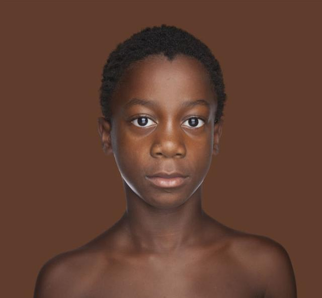
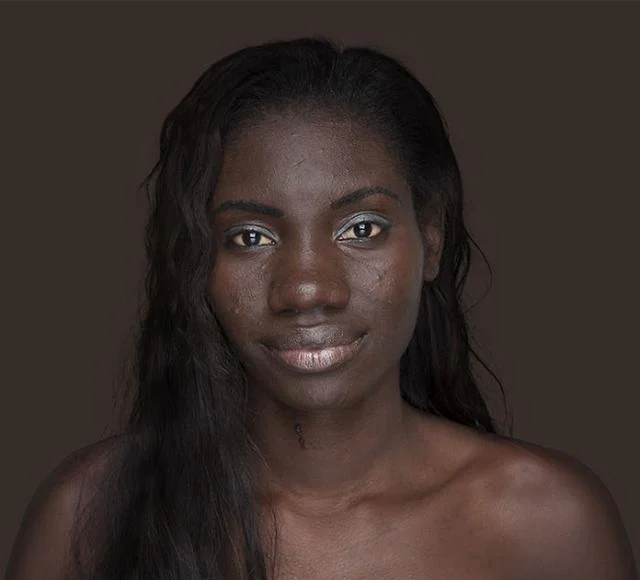

# 作業：人臉瞳孔偵測
## 開發環境
https://colab.research.google.com/?hl=zh-tw

## 程式碼
```python=
import cv2
import numpy as np
from google.colab.patches import cv2_imshow
from google.colab import files
import math

# 上傳圖片
files.upload()

img = cv2.imread('face4.webp')
if img is None:
    raise ValueError("圖片讀不到")

gray = cv2.cvtColor(img, cv2.COLOR_BGR2GRAY)

# =========================
# Step 1: Gaussian Blur
# =========================
blur = cv2.GaussianBlur(gray, (9,9), 1.5)

# =========================
# Step 2: Hough Circle（抓瞳孔）
# =========================
circles = cv2.HoughCircles(
    blur,
    cv2.HOUGH_GRADIENT,
    dp=1,
    minDist=50,
    param1=100,
    param2=20,
    minRadius=5,
    maxRadius=50
)

# 複製圖畫結果
output = img.copy()

centers = []

if circles is not None:
    circles = np.uint16(np.around(circles))

    print("偵測到圓數量:", len(circles[0]))

    for (x, y, r) in circles[0]:
        # 畫圓
        cv2.circle(output, (x, y), r, (0,255,0), 2)
        # 畫中心
        cv2.circle(output, (x, y), 2, (0,0,255), 3)

        centers.append((x, y))

# =========================
# Step 3: 計算兩眼距離
# =========================
if len(centers) >= 2:
    (x1, y1) = centers[0]
    (x2, y2) = centers[1]

    distance = math.sqrt((x1 - x2)**2 + (y1 - y2)**2)

    print("左眼中心:", (x1, y1))
    print("右眼中心:", (x2, y2))
    print("兩眼距離:", distance)
else:
    print("偵測不到兩個瞳孔")

cv2_imshow(output)
```
## 兩眼距離公式
```py
distance = math.sqrt((x1 - x2)**2 + (y1 - y2)**2)
```

## Tools流程
+ **高斯模糊（Gaussian Blur）**
+ **霍夫圓轉換（Hough Circle Transform）**


**Saving face.png to face (1).png**
**偵測到圓數量: 2**

**左眼中心: (np.uint16(106), np.uint16(280))**

**右眼中心: (np.uint16(284), np.uint16(236))**

**兩眼距離: 183.35757415498276**


**Saving face1.png to face1.png**
**偵測到圓數量: 2**

**左眼中心: (np.uint16(424), np.uint16(126))**

**右眼中心: (np.uint16(222), np.uint16(120))**

**兩眼距離: 202.08908926510605**


**Saving face2.png to face2.png**

**偵測到圓數量: 2**

**左眼中心: (np.uint16(224), np.uint16(68))**

**右眼中心: (np.uint16(94), np.uint16(50))**

**兩眼距離: 131.24023773218335**



**Saving face3.jpg to face3 (1).jpg**

**偵測到圓數量: 2**

**左眼中心: (np.uint16(282), np.uint16(240))**

**右眼中心: (np.uint16(384), np.uint16(242))**

**兩眼距離: 102.0196059588548**





**左眼: (203, 221)**

**右眼: (333, 255)**

**瞳孔距離: 134.3726162579266**


